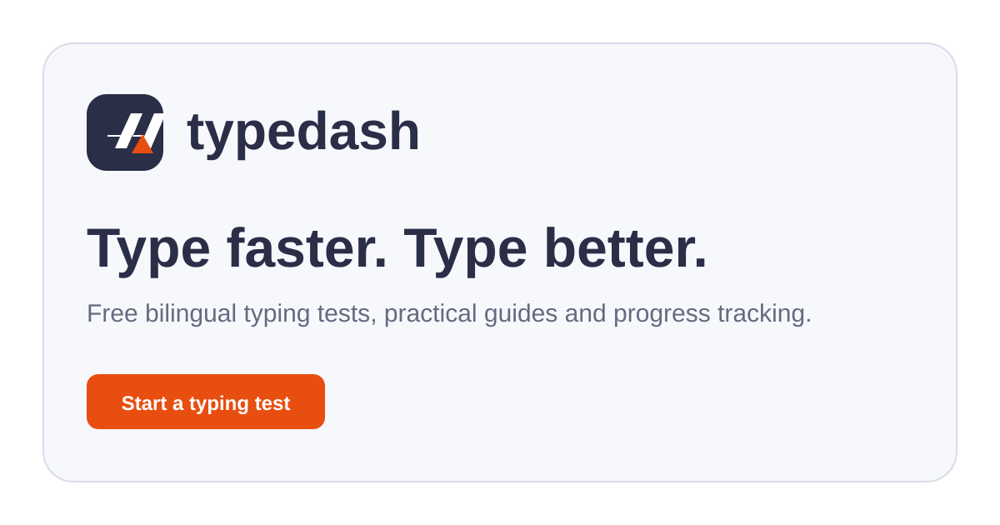
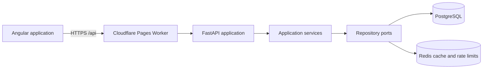

<p align="center">
  <a href="https://typedash.online">
    
  </a>
</p>

<h1 align="center">TypeDash</h1>

<p align="center">
  A fast, focused typing test for improving speed, accuracy, and consistency.
</p>

<p align="center">
  <a href="https://typedash.online"><strong>Start typing</strong></a>
  ·
  <a href="https://typedash.online/progress">View progress</a>
  ·
  <a href="https://github.com/m1miage-benammma/TypeDash/issues">Report an issue</a>
</p>

<p align="center">
  <a href="https://github.com/m1miage-benammma/TypeDash/actions/workflows/build-checks.yml"></a>
  <a href="https://github.com/m1miage-benammma/TypeDash/releases"></a>
  <a href="https://typedash.online"></a>
  
  
  
</p>

<p align="center">
  <a href="https://typedash.online">
    
  </a>
</p>

## About

TypeDash is a typing practice application for English and French. It combines a distraction-free interface with server-authoritative scoring, personal progress, and global leaderboards. Sessions are linked securely to the current browser—no account or password is required to start practising.

The project is built as a production-ready full-stack application: Angular on the frontend, a hexagonal FastAPI backend, PostgreSQL for persistent data, Redis for caching and distributed rate limits, and Docker for every local and CI workflow.

## Highlights

| Practice | Progress | Experience |
| --- | --- | --- |
| English and French word pools | WPM, accuracy, and active time | Light and dark themes |
| Easy, medium, and hard modes | Per-session speed chart | Responsive desktop and mobile UI |
| 15 s, 30 s, 60 s, or custom duration | Personal best and session history | Native mobile keyboard support |
| Optional punctuation and numbers | Average-WPM and top-speed boards | Accessible keyboard-first controls |
| Multi-line or word-by-word display | Difficulty shown per leaderboard entry | SEO-ready public content pages |

Additional details:

- Words and leaderboard responses are cached to keep navigation and repeat visits fast.
- Typing metrics are calculated by the backend and saved when a session finishes.
- French ligatures accept their common keyboard equivalent—for example, `coeur` matches `cœur`.
- The timer starts on the first character and pauses after 1.2 seconds of inactivity.
- A signed, HttpOnly session cookie protects device-linked usernames and history.

## Quick start

### Requirements

- [Docker Desktop](https://www.docker.com/products/docker-desktop/) or Docker Engine
- Docker Compose v2
- Git

### Run locally

```bash
git clone https://github.com/m1miage-benammma/TypeDash.git
cd TypeDash
```

Create a `.env` file in the project root:

```dotenv
TYPEDASH_DB_NAME=typedash
TYPEDASH_DB_USERNAME=typedash
TYPEDASH_DB_PASSWORD=change-this-local-password
```

Start the complete development stack:

```bash
docker compose up -d --build
```

Open:

- Frontend: [http://localhost:4200](http://localhost:4200)
- API documentation: [http://localhost:8000/docs](http://localhost:8000/docs)
- Health check: [http://localhost:8000/api/health](http://localhost:8000/api/health)

The development stack includes Angular with hot reload, FastAPI with reload, PostgreSQL 16, and Redis 7.4.

## Docker commands

| Command | Purpose |
| --- | --- |
| `docker compose up -d --build` | Build and start the development stack |
| `docker compose logs -f` | Follow application logs |
| `docker compose down` | Stop the stack while preserving database data |
| `docker compose down -v` | Stop the stack and delete local database data |
| `docker compose -f docker-compose.ci.yml build backend frontend` | Build both production images |
| `docker compose -f docker-compose.ci.yml --profile checks run --build --rm frontend-checks` | Run frontend checks in Docker |

Convenience wrappers are also available:

```powershell
./scripts/dev.ps1 up       # Windows PowerShell
./scripts/dev.ps1 checks
```

```bash
sh scripts/dev.sh up       # Linux or macOS
sh scripts/dev.sh checks
```

## Architecture



The backend follows a hexagonal structure: HTTP routers translate requests, application services own business rules, repository ports define persistence boundaries, and PostgreSQL/Redis implementations remain replaceable adapters. The frontend keeps calculations on the server and focuses on interaction, state, and presentation.

```text
TypeDash/
├── backend/
│   ├── app/api/           # FastAPI routers, requests, and responses
│   ├── app/models/        # Domain entities
│   ├── app/ports/         # Repository interfaces
│   ├── app/repositories/  # PostgreSQL, Redis, and memory adapters
│   └── app/services/      # Application and typing logic
├── frontend/
│   ├── src/app/core/      # Session, preferences, SEO, and shared models
│   ├── src/app/features/  # Typing game, progress, leaderboard, and guides
│   └── src/app/layouts/   # Application shell, header, and footer
├── scripts/               # Docker development helpers
└── .github/workflows/     # Build verification and manual deployment
```

## Technology

- **Frontend:** Angular 21, TypeScript, RxJS, Tailwind CSS 4, GSAP, Font Awesome
- **Backend:** Python 3.12, FastAPI, Pydantic, Psycopg 3
- **Data:** PostgreSQL 16, Redis 7.4
- **Infrastructure:** Docker Compose, Cloudflare Pages, Render, GitHub Actions
- **Quality:** production Docker builds, frontend regression checks, health-gated deployment

## Security and privacy

TypeDash uses a server-issued signed cookie with `HttpOnly`, `Secure`, and `SameSite=Strict` in production. A public device UUID is never treated as authentication. PostgreSQL Row Level Security restricts device-owned data, while a bounded read-only database function supplies public leaderboard entries.

Requests are protected by body and input limits, distributed rate limiting, strict origin checks, Content Security Policy, frame blocking, and production-only HTTPS. Deployment credentials remain in GitHub Actions secrets and are checked against public build artifacts before publication.

Progress belongs to the browser session. Clearing the TypeDash cookie removes that browser's access to its existing history. See [Privacy preferences](https://typedash.online/) on the website to manage analytics consent.

## Deployment

Production uses two independently deployable services:

- **Frontend:** Cloudflare Pages and a lightweight Worker proxy
- **Backend:** Render running the production FastAPI container

Deployment is manual through the **Deploy production** GitHub Actions workflow. It accepts only `main`, verifies both Docker images, deploys the exact commit to Render, waits for a healthy backend, then publishes the already verified frontend artifact to Cloudflare Pages.

Required repository secrets:

- `CLOUDFLARE_API_TOKEN`
- `RENDER_API_KEY`
- `RENDER_SERVICE_ID`

Never commit local `.env` files or deployment credentials.

## Contributing

1. Fork the repository and create a focused branch.
2. Keep frontend and backend boundaries intact.
3. Run the Docker production build and relevant checks.
4. Open a pull request describing the behaviour changed and how it was verified.

Bug reports and focused improvements are welcome through [GitHub Issues](https://github.com/m1miage-benammma/TypeDash/issues).

## Brand

TypeDash uses navy `#2A2E47`, orange `#E84E10`, and white `#FFFFFF`, with red reserved for typing mistakes. TypeDash is an independent project and is not affiliated with Monkeytype or Université Grenoble Alpes.
